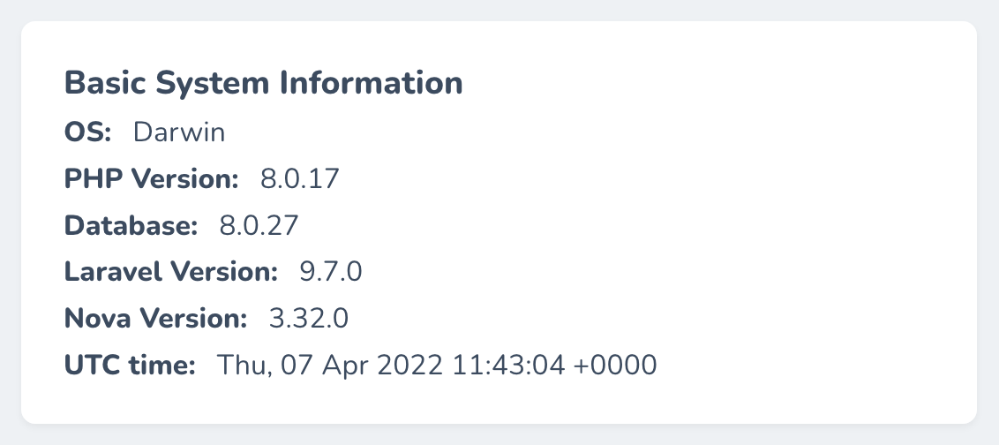

# Nova System Info Card

This is the forked version of the [nova-system-info-card](https://github.com/CoreProc/nova-system-info-card) developed by [coreproc](https://github.com/CoreProc). This has been forked out for some custom ui-dimensions and custom requirements. Thanks coreproc for a useful package.

[](https://packagist.org/packages/codeat3/nova-system-info-card)
[](https://packagist.org/packages/codeat3/nova-system-info-card)

Get the basic system information of the server running your web application right from your Nova dashboard.



## Installation

You can install the package in to a Laravel app that uses [Nova](https://nova.laravel.com) via composer:

```bash
composer require codeat3/nova-system-info-card
```

## Usage

Register the card with Nova. This is typically done in the `cards` method of the `NovaServiceProvider`.

```php
// in app/Providers/NovaServiceProvder.php

// ...
public function cards()
{
    return [
        // ...
        new \Codeat3\NovaSystemInfoCard\SystemInfoCard(),
    ];
}
```

### Testing

``` bash
composer test
```

### Changelog

Please see [CHANGELOG](CHANGELOG.md) for more information what has changed recently.

## Contributing

Please see [CONTRIBUTING](CONTRIBUTING.md) for details.

### Security

If you discover any security related issues, please email chris.bautista@codeat3.ph instead of using the issue tracker.

## Credits

- [Chris Bautista](https://github.com/chrisbjr)
- [All Contributors](../../contributors)

## License

The MIT License (MIT). Please see [License File](LICENSE.md) for more information.
